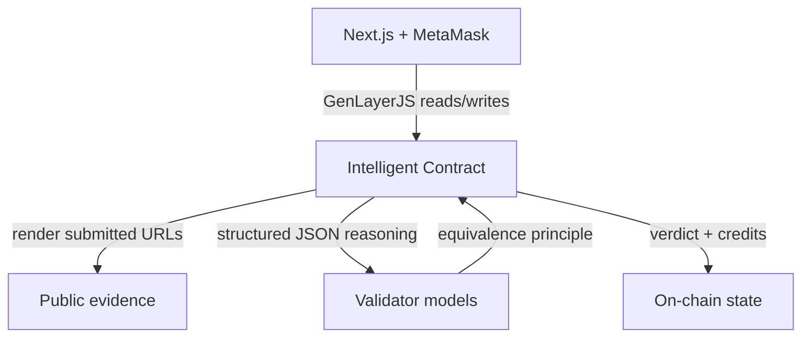
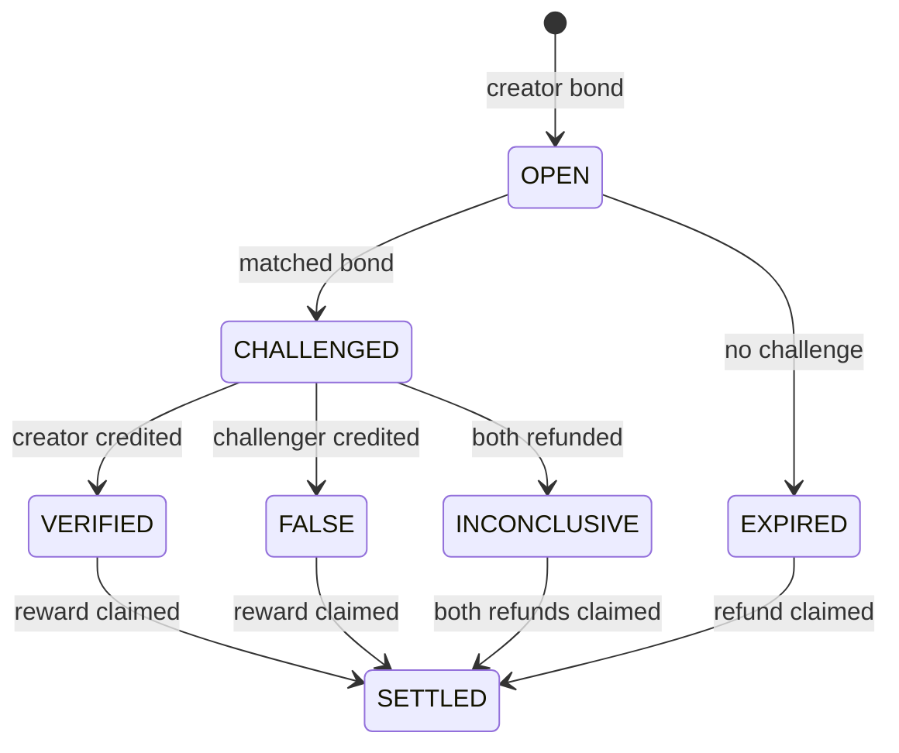

# TruthBond


> TruthBond turns disputed real-world claims into on-chain, evidence-backed verdicts using GenLayer consensus.

TruthBond is an on-chain evidence challenge protocol. A creator states an objectively verifiable claim and locks a GEN bond; a challenger matches it; both parties add public evidence; then a GenLayer Intelligent Contract coordinates independent validator web retrieval and LLM reasoning. The structured consensus verdict changes contract state and assigns the bonded funds.

## Live deployment

| Item | Value |
| --- | --- |
| Network | GenLayer Studionet (chain ID `61999`) |
| Contract | `TruthBondIntelligentContract` |
| Address | [`0x9Cd93529fFba38Dc5c07eC8e9eef93D56E48d569`](https://explorer-studio.genlayer.com/address/0x9Cd93529fFba38Dc5c07eC8e9eef93D56E48d569) |
| Deployment | [`0x9054a10345235bfdb07e68fcef4d1a68a7abb829b5cb2549332dd4e858e1dc83`](https://explorer-studio.genlayer.com/tx/0x9054a10345235bfdb07e68fcef4d1a68a7abb829b5cb2549332dd4e858e1dc83) |
| RPC | `https://studio.genlayer.com/api` |

## Why GenLayer

A deterministic smart contract cannot independently visit today’s public web, compare conflicting sources, interpret date language, or decide whether evidence satisfies natural-language resolution criteria. An oracle could post an answer, but that merely moves trust to one off-chain publisher.

TruthBond uses GenLayer for the application’s core decision. Every validator executes the Intelligent Contract’s non-deterministic adjudication path, independently retrieves the submitted URLs, and asks its model for a strict JSON decision. The equivalence principle compares the essential result—verdict, factual conclusion, and evidence sufficiency—while allowing bounded confidence/count variation and different prose. Consensus then commits a verdict and settlement credits to chain state.

## How it works

1. **Creator → bond:** `create_claim` stores the claim, explicit criteria, deadlines, and `gl.message.value`.
2. **Challenge → matched bond:** another address calls `challenge_claim` with exactly the creator bond.
3. **Evidence:** either party submits public `https://` URLs and a factual note.
4. **GenLayer consensus:** after the challenge window, `resolve_claim` runs web retrieval and structured LLM reasoning inside `gl.vm.run_nondet_unsafe`.
5. **Verdict:** `VERIFIED`, `FALSE`, or `INCONCLUSIVE` is written on-chain with confidence, source counts, and a reason.
6. **Settlement:** the total pot is credited to the creator, credited to the challenger, or refunded respectively. `claim_reward` enforces pull-based, one-time payment.

## Architecture



- `contracts/truthbond.py` — current GenVM Python contract with payable bonds, guarded state machine, intelligent resolution, reputation, and transfer emission.
- `app/`, `components/`, `lib/truthbond/` — responsive Next.js/TypeScript interface, real Studionet reads and MetaMask-signed writes.
- `tests/direct/test_truthbond.py` — direct GenLayer contract tests covering happy-path and adversarial transitions.
- `docs/` — reviewer flow, security model, and submission materials.

No backend or centralized adjudicator is required.

## Contract methods

| Method | Type | Purpose |
| --- | --- | --- |
| `create_claim` | payable | Create a unique objective claim and escrow the creator bond. |
| `challenge_claim` | payable | Match the bond before the deadline; self/second challenges are rejected. |
| `submit_evidence` | write | Add a validated public URL, note, and support/contest signal. |
| `resolve_claim` | intelligent write | Retrieve evidence, run validator reasoning, commit verdict and credits. |
| `expire_claim` | write | Refund an unchallenged creator after the challenge window. |
| `resolve_timeout` | write | Refund both parties if a challenged claim misses the resolution window. |
| `claim_reward` | write | Emit a one-time transfer for the caller’s finalized credit. |
| `get_claim`, `get_claims`, `get_claim_evidence` | view | Read public claim and evidence state. |
| `get_user_reputation`, `get_protocol_stats` | view | Read participation and protocol aggregates. |
| `get_contract_metadata` | view | Read contract identity and consensus design. |

## State machine and settlement



## Intelligent resolution and safety

- Each validator retrieves evidence inside its own non-deterministic execution; the leader cannot simply supply the pages it prefers.
- Page text is delimited as untrusted evidence. The prompt forbids treating website instructions as adjudication rules or transfer commands.
- Only public `https://` URLs are accepted. Loopback, private-network, credential-bearing, and malformed URLs are rejected.
- The model returns strict JSON: verdict, confidence, source counts, essential conclusion, evidence sufficiency, and a concise reason.
- A single accessible supporting source cannot produce a conclusive result; inaccessible, contradictory, or insufficient evidence can produce `INCONCLUSIVE`.
- Settlement is derived only from consensus. Model/web text never chooses recipients or amounts.
- Checks block empty claims, zero bonds, duplicate IDs/evidence, self-challenges, wrong matched values, invalid stages, early/late resolution, and duplicate withdrawals.

## Local development

Requirements: Node.js 22.13+, Python 3.12+, and MetaMask for writes.

```bash
npm install
npm run dev
```

The frontend reads the committed Studionet deployment without secrets. Connect MetaMask and accept the network-add/switch request for chain `61999` to send transactions. Never enter a seed phrase or private key into this app.

```bash
npm run build
npm run lint
python -m pytest tests/direct -q
python -m py_compile contracts/truthbond.py
```

## Deployment

The contract was deployed through GenLayer Studio in **Normal (Full Consensus)** mode using the dependency pin at the top of `contracts/truthbond.py`. To deploy another instance:

1. Create a Python Intelligent Contract in GenLayer Studio.
2. Paste `contracts/truthbond.py`, leaving the dependency header intact.
3. Select Normal (Full Consensus), deploy, and wait for `FINALIZED`.
4. Call `get_contract_metadata` and confirm the contract/version.
5. Replace the address and deployment transaction in `lib/truthbond/deployment.ts`.

Frontend transactions wait for `FINALIZED` and also require GenVM execution result `FINISHED_WITH_RETURN`; submission alone is not treated as success.

## Demo scenario

Claim ID: `truthbond-demo-002`

> Ethereum's Dencun upgrade activated on mainnet on March 13, 2024.

Creator and challenger each bonded 1 GEN. Evidence includes the [Ethereum Foundation mainnet announcement](https://blog.ethereum.org/2024/02/27/dencun-mainnet-announcement) and an [independent Investopedia report](https://www.investopedia.com/cryptocurrency-market-news-mar-18-bitcoin-and-ether-prices-fall-after-dencun-upgrade-8610485). See `docs/DEMO.md` for finalized transaction evidence and exact reviewer steps.

Finalized result: **VERIFIED, 97/100 confidence, 3 confirming and 0 contradicting sources**. The creator received a 2 GEN contract credit and the one-time settlement transaction moved the claim to `SETTLED` / `DISPATCHED`.

## Limitations

- Studionet is a development network; test GEN has no represented monetary value.
- Web availability and model outputs are non-deterministic. The equivalence principle compares essential conclusions instead of prose.
- URL validation and content truncation reduce risk but cannot make arbitrary public web content intrinsically trustworthy.
- GenLayer Studio currently notes limitations for testing token transfers and contract-to-contract interactions. Verdict credit assignment is inspectable in contract state; payout validation is documented with the actual observed result.
- One challenger per claim keeps settlement legible for this submission build.

## Future improvements

Source-domain diversity scoring, appeal rounds with additional bonds, evidence content hashes, claim templates, protocol fees governed by a DAO, and Bradbury deployment after Studionet validation.

## Official references

- [Intelligent Contracts](https://docs.genlayer.com/developers/intelligent-contracts/introduction)
- [Equivalence principle](https://docs.genlayer.com/developers/intelligent-contracts/equivalence-principle)
- [Web access](https://docs.genlayer.com/developers/intelligent-contracts/web-access)
- [Value transfers](https://docs.genlayer.com/developers/intelligent-contracts/advanced/value-transfers)
- [GenLayerJS](https://docs.genlayer.com/developers/frontend-development/genlayer-js)

## License

MIT
